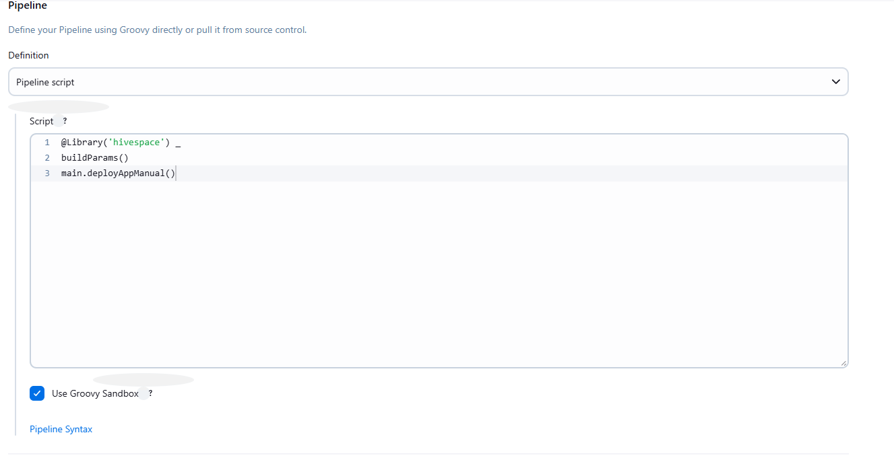

# Jenkins Overview

## Installing Jenkins
### Docker
1. Create a bridge network in Docker 
 `docker network create jenkins`

2. Run a docker:dind Docker image <pre>
docker run --name jenkins-docker --rm --detach ^
  --privileged --network jenkins --network-alias docker ^
  --env DOCKER_TLS_CERTDIR=/certs ^
  --volume jenkins-docker-certs:/certs/client ^
  --volume jenkins-data:/var/jenkins_home ^
  --publish 2376:2376 ^
  docker:dind
</pre>

3. Customize the official Jenkins Docker image, by executing the following two steps: 

Create a Dockerfile with the following content:
```dockerfile
FROM jenkins/jenkins:2.504.3-jdk21
USER root
RUN apt-get update && apt-get install -y lsb-release
RUN curl -fsSLo /usr/share/keyrings/docker-archive-keyring.asc \
  https://download.docker.com/linux/debian/gpg
RUN echo "deb [arch=$(dpkg --print-architecture) \
  signed-by=/usr/share/keyrings/docker-archive-keyring.asc] \
  https://download.docker.com/linux/debian \
  $(lsb_release -cs) stable" > /etc/apt/sources.list.d/docker.list
RUN apt-get update && apt-get install -y docker-ce-cli
USER jenkins
RUN jenkins-plugin-cli --plugins "blueocean docker-workflow json-path-api" 
```

Build a new docker image from this Dockerfile and assign the image a meaningful name, e.g. "myjenkins-blueocean:2.504.3-1":

`docker build -t myjenkins-blueocean:2.504.3-1 .`

## Create deployment jobs
### 1. Create manunal job
This Jenkins pipeline uses the shared library hivespace. It first loads parameters using `buildParams()`, then proceeds to manually deploy the application with `main.deployAppManual()`


## Create Nodes
In the Manage Jenkins > Nodes section, we configure agent nodes for job execution.

In VM, run this command to connect to jenkins master
<pre>
 java -jar agent.jar -url http://172.26.112.1:8080/ -secret a95a4bf5023d9e915f548da9c6eeea6e3f0f962af78c7dbf746bf8f297dcf6ce -name UbuntuSlave01 -workDir "/home/nptinh/agent"
 </pre>